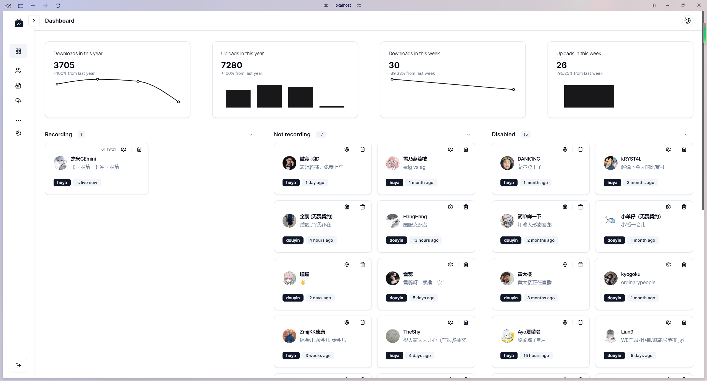
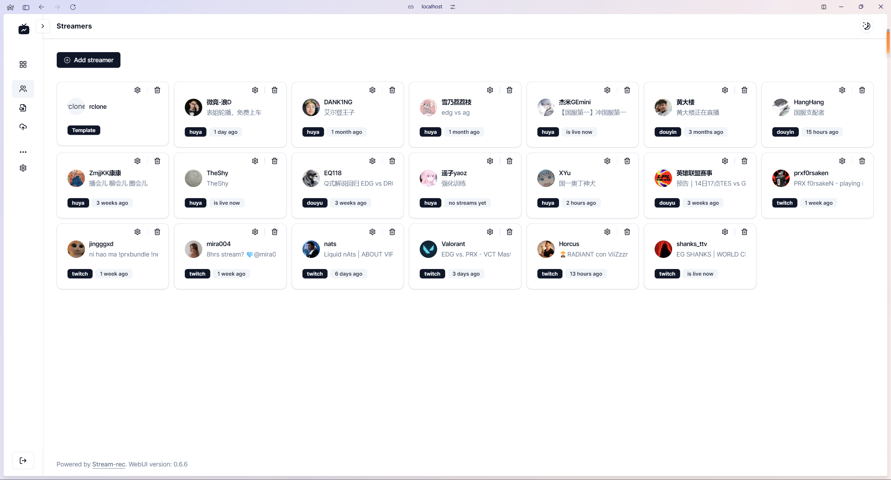
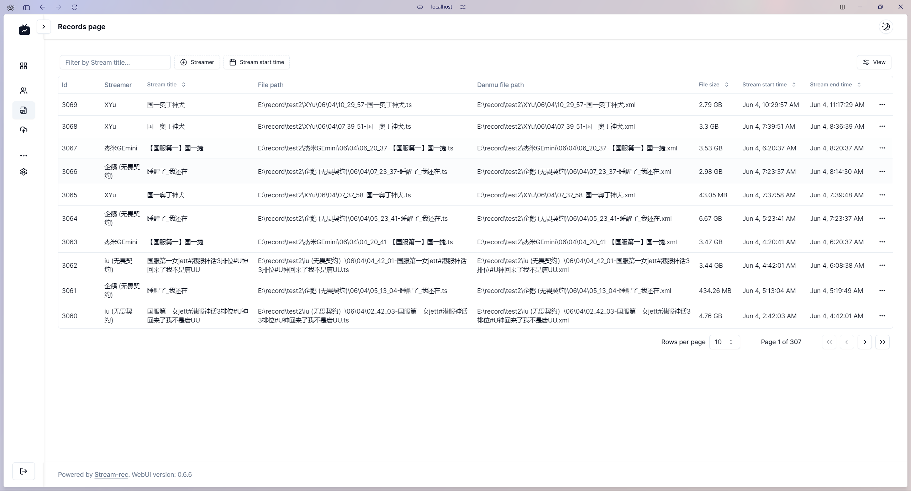
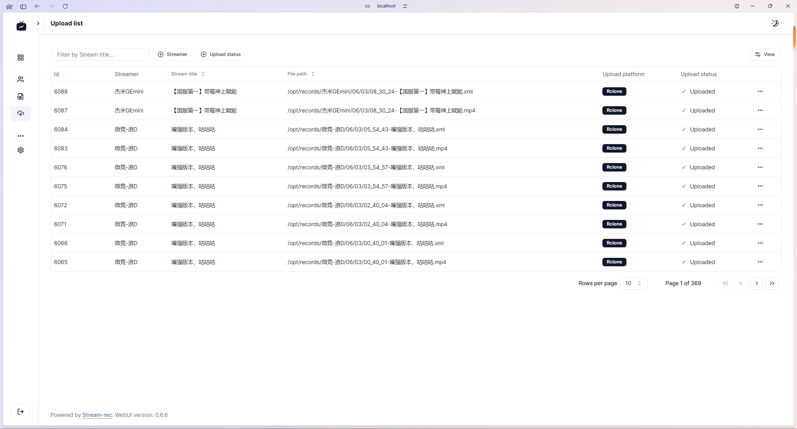
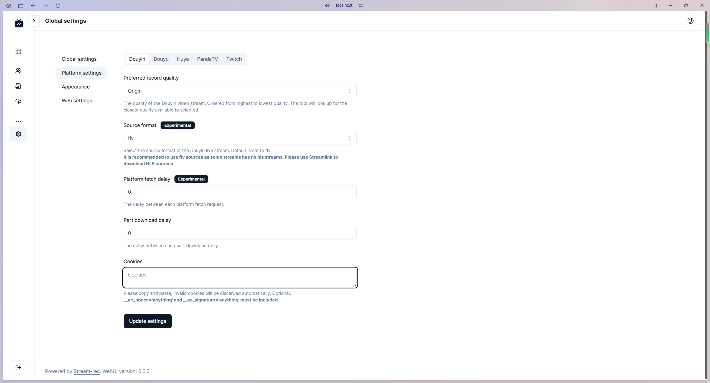

This is a [Next.js](https://nextjs.org/) project bootstrapped
with [`create-next-app`](https://github.com/vercel/next.js/tree/canary/packages/create-next-app).

This is the frontend service for [Stream-rec](https://github.com/hua0512/stream-rec) project.

> [!NOTE]\
> It is a personal project to learn Next.js, React, and other technologies. Feel free to give me any suggestions or feedback.

## Screenshots

<table>
  <tr>
    <td></td>
    <td></td>
    <td></td>
  </tr>
  <tr>
    <td></td>
    <td></td>
    <td></td>
  </tr>
</table>

## Technologies

- [Next.js](https://nextjs.org/)
- [React](https://reactjs.org/)
- [ShadcnUI](https://ui.shadcn.com/)
- [NextAuth.js](https://next-auth.js.org/) for JWT authentication
- Internationalization with [next-intl](https://next-intl-docs.vercel.app/)

## Getting Started

First, set up the environment variables:

- `API_URL`: The backend API URL. Default is `http://localhost:12555/api`.
- `WS_API_URL`: The backend WebSocket API URL. Default is `ws://localhost:12555/live/update`.
- `NEXTAUTH_SECRET`: The secret key for NextAuth, you can generate one with `openssl rand -base64 32` or just use a random string.
- `NEXTAUTH_URL`: The NextAuth URL. Default is `http://localhost:15275`.

Then, run the development server:

```bash
npm run dev
# or
yarn dev
# or
pnpm dev
# or
bun dev
```

or build the project:

```bash
npm run build
# or
yarn build
# or
pnpm build
# or
bun build
```

and start the server:

```bash
npm run start
# or
yarn start
# or
pnpm start
# or
bun start
```

Open [http://localhost:15275](http://localhost:15275) with your browser to see the result.

## Deploy on Vercel

The easiest way to deploy your Next.js app is to use
the [Vercel Platform](https://vercel.com/new?utm_medium=default-template&filter=next.js&utm_source=create-next-app&utm_campaign=create-next-app-readme)
from the creators of Next.js.


> [!IMPORTANT]\
> Things to note:
> - The environment variables should be set in the Vercel dashboard.
> - Vercel will automatically set the `NEXTAUTH_URL` environment variable.

Check out our [Next.js deployment documentation](https://nextjs.org/docs/deployment) for more details.
